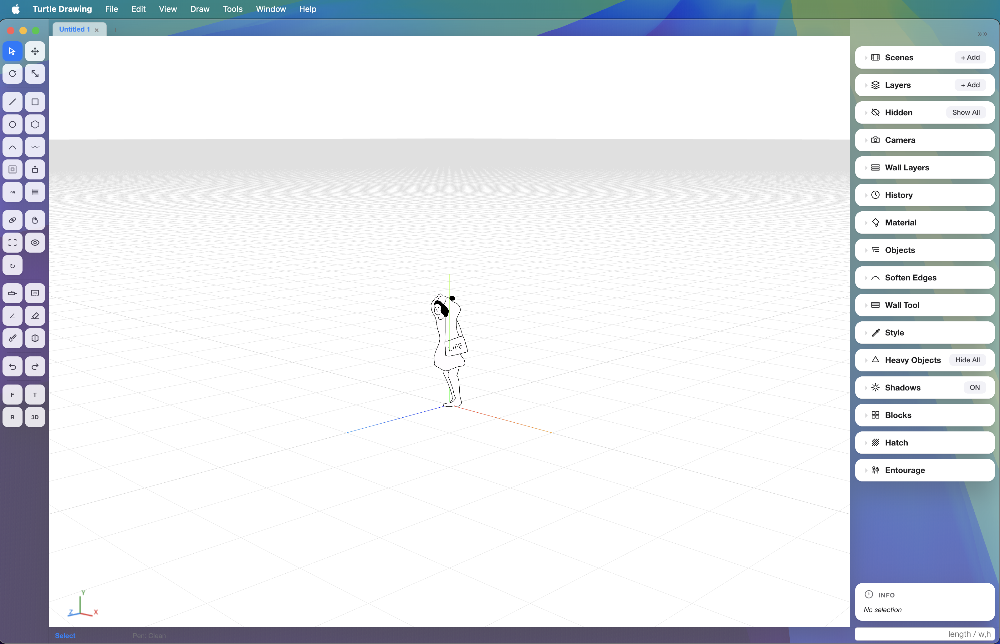

<div align="center">

<picture>
  <source media="(prefers-color-scheme: dark)" srcset="build/turtle_white.png">
  
</picture>

## Turtle Drawing

**Architectural modeling for Mac.**
An easy 3D modeling tool.

[](https://github.com/turtledrawing-lab/turtle-drawing/releases/latest)
[]()

[**Download (Releases)**](https://github.com/turtledrawing-lab/turtle-drawing/releases/latest)

**English** · [한국어](README.md)

</div>

---

## ✨ Features

- Imports & edits mesh models from Sketchup (`.obj`) and Rhino (`.3dm`) for interoperability
- **2D ↔ 3D unified**: draw faces with Line / Rectangle / Circle, then **Extrude (P)** to instant 3D
- **Wall Tool**: walls with thickness & height in one stroke. Multi-layer assemblies (finish + insulation + structure) auto-generated
- **Section Plane**: slice the model — cut surface fills with **hatch + section line** automatically
- **Layers (CAD-style)**: per-layer **line weight (mm)** + **hatch pattern** drive drawing hierarchy on export
- **Scenes**: capture camera position + section state, fly between them smoothly
- **Entourage**: drag-place people, plants and other PNG/SVG figures (upload your own too)
- **SVG / PNG export**: auto-labeled drawing sheets with scale settings

---

## 📦 Install

### Download
Grab the right `.dmg` from the [Releases page](https://github.com/turtledrawing-lab/turtle-drawing/releases/latest):
- **Apple Silicon (M1/M2/M3/M4)** → `arm64.dmg`
- **Intel Mac** → `x64.dmg`

### Install
1. Double-click the `.dmg`
2. Drag **Turtle Drawing.app** into the **Applications** folder
3. Double-click it from Applications

### First-launch warning (current alpha — unsigned build)
> Notarized signed builds will land from the official v1.0 release — no warnings then.

If you see an "unidentified developer" alert:
- **Option 1**: in Applications, **right-click → Open** → "Open" again
- **Option 2**: one line in Terminal:
  ```
  xattr -dr com.apple.quarantine /Applications/Turtle\ Drawing.app
  ```

---

## 🚀 Quick Start

First time? Hit the menubar → **Help → Onboarding Tour**. Toby (🐢) walks you through the core features step by step.

### Shortcuts (the ones you'll use most)

| Key | Tool |
|---|---|
| `L` | Line |
| `R` | Rectangle |
| `C` | Circle |
| `P` | Extrude (Push/Pull) |
| `M` | Move |
| `Q` | Rotate |
| `S` | Scale |
| `T` | Ruler |
| `Space` | Toggle Select ↔ active tool |
| `F` | Frame selection |
| `Esc` | Cancel tool / clear selection |
| `Cmd+S` | Save (.tt) |
| `Cmd+Z` / `Cmd+Shift+Z` | Undo / Redo |

### Mouse
- **Middle-drag** — orbit
- **Shift + middle-drag** — pan
- **Wheel** — zoom

---

## 🛠️ System Requirements

- macOS 10.12 (Sierra) or later
- Apple Silicon or Intel Mac

---

## 📸 Screenshot



---

## 🐞 Bug reports & feature requests

Please open an [Issue](https://github.com/turtledrawing-lab/turtle-drawing/issues).

---

## 📄 License

Alpha stage — personal use is free. Commercial use / redistribution terms will be announced with the official release.

---

<div align="center">

Made with 🐢 by **LIFE architects**

</div>
